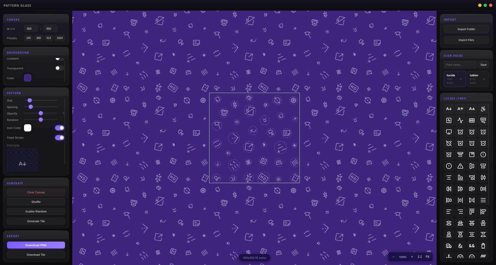

# Vitrum



**Seamless pattern maker with liquid glass design** — a desktop app built with Electron, React, TypeScript, and Canvas for creating beautiful repeating patterns from SVG icons.

---

## Overview

Vitrum lets you build seamless repeating patterns by placing SVG icons on a tileable canvas. It features a custom **liquid glass** dark UI, infinite canvas zoom/pan, drag-and-drop icon placement, per-icon transform controls (move, resize, rotate), gradient/solid/transparent backgrounds, recoloring, fixed-stroke SVG rendering, and PNG export.

Ships with **~7,000 built-in icons** (Lucide + Tabler Icons) and supports importing custom SVG/PNG folders or saving custom icon packs.

---

## Features

### Pattern Canvas
- **Infinite zoom/pan** — mouse wheel to zoom (Ctrl+wheel for fine), drag empty space to pan
- **Seamless tiling** — pattern repeats infinitely in all directions via offscreen tile caching
- **Per-icon controls** — click to select, then drag to move; corner handle to resize; top handle to rotate
- **Canvas size presets** — 100, 300, 512, 1024 px (or custom 16–4096)
- **Viewport zoom** — 10%–500% with Fit-to-window and 1:1 buttons

### Icon Management
- **Built-in packs**: Lucide (~1,100) + Tabler Icons Outline (~5,900)
- **Import folder** — recursively scans a directory for SVGs/PNGs, auto-loads as data URLs
- **Import files** — pick multiple image files at once
- **Save packs** — persist custom icon sets to `%APPDATA%/vitrum/icon-packs/`
- **Delete packs** — remove saved packs from the sidebar
- **Virtualized grid** — lazy-loads 80 icons at a time for smooth scrolling through thousands

### Background & Styling
- **Solid color** — single hex color
- **Linear gradient** — 2+ stops, adjustable angle (0–360°), live gradient editor
- **Transparent** — checkerboard preview, exports as transparent PNG
- **Icon recoloring** — apply a single color to all placed icons (source-in compositing)
- **Fixed stroke** — keeps SVG stroke width visually constant at any icon size (patches stroke-width on render)

### Export
- **Save as PNG** — native save dialog, respects transparent background, exports at exact canvas pixel dimensions

### UI / UX
- **Custom titlebar** — frameless window with traffic-light controls (min/max/close)
- **Liquid glass design** — frosted glass panels, subtle highlights, accent glow, dark theme
- **Three-panel layout** — Sidebar (controls) • Canvas (center) • Icon Picker (right)
- **Keyboard shortcuts** — Delete/Backspace to remove selected icon
- **Responsive** — ResizeObserver keeps canvas sharp on window resize

---

## Tech Stack

| Layer | Technology |
|-------|------------|
| Framework | **Electron 33** (main process) |
| UI | **React 18** + **TypeScript** (renderer) |
| Build | **esbuild** (bundler), **TypeScript** (type-check) |
| State | Tiny pub/sub store (`useStore.ts`) — no Redux/Zustand |
| Rendering | **Canvas 2D API** (offscreen tile + tiled draw) |
| Icons | **lucide-static**, **@tabler/icons** (bundled at build) |
| Native dialogs | Electron `dialog` API (folder, files, save) |

---

## Project Structure

```
vitrum/
├── src/
│   ├── main/
│   │   ├── main.ts        # Electron main process (window, IPC, file I/O)
│   │   └── preload.ts     # Context bridge (exposes electronAPI to renderer)
│   └── renderer/
│       ├── index.html     # Single-file HTML + CSS (liquid glass design system)
│       └── src/
│           ├── app.tsx                    # Root component
│           ├── components/
│           │   ├── TitleBar.tsx           # Custom frameless window controls
│           │   ├── Sidebar.tsx            # All pattern/background controls
│           │   ├── PatternCanvas.tsx      # Canvas rendering + interaction
│           │   └── IconPicker.tsx         # Icon packs, import, virtualized grid
│           ├── store/
│           │   └── useStore.ts            # Global state + subscriptions
│           └── styles/                    # (empty — all CSS in index.html)
├── default-icons/          # (gitignored) copied from node_modules at build
├── icon-packs/             # User data dir (created at runtime)
├── build.mjs               # esbuild + asset copy script
├── package.json
├── tsconfig.json
└── tsconfig.renderer.json
```

---

## Getting Started

### Prerequisites
- **Node.js 18+**
- **npm** (or pnpm/yarn)

### Install
```bash
git clone https://github.com/yanik-v86/vitrum.git
cd vitrum
npm install
```

### Development
```bash
npm run dev
```
Builds TypeScript → bundles with esbuild → launches Electron with dev tools.

### Production Build
```bash
npm run build
```
Outputs to `dist/`:
- `dist/main/main.js` — bundled main process
- `dist/main/preload.js` — bundled preload
- `dist/renderer/bundle.js` — React app bundle
- `dist/renderer/index.html` — entry HTML
- `dist/default-icons/{lucide,tabler}/` — bundled SVG icons

### Run Built App
```bash
npm start
```

---

## Usage

### Placing Icons
1. Open the **Icon Picker** (right panel)
2. Select a pack (Lucide, Tabler, or imported)
3. Click any icon → places it at canvas center
4. Or drag from picker directly onto canvas

### Manipulating Icons
| Action | How |
|--------|-----|
| **Move** | Drag icon body |
| **Resize** | Drag bottom-right corner handle |
| **Rotate** | Drag top-center handle (connected by line) |
| **Select** | Click icon (shows selection ring + handles) |
| **Delete** | Select icon → press `Delete` or `Backspace` |
| **Reorder** | Last placed = topmost (no z-index UI yet) |

### Adjusting Pattern
- **Sidebar → Canvas** — set tile width/height
- **Sidebar → Pattern** — global size, spacing, opacity, rotation for *new* placed icons
- **Sidebar → Background** — color / gradient / transparent
- **Sidebar → Generate → Clear Canvas** — wipe all placed icons

### Importing Custom Icons
1. **Icon Picker → Import Folder** — picks a directory, recursively loads all `.svg`, `.png`, `.jpg`, `.webp`, `.gif`
2. **Icon Picker → Import Files** — multi-select individual files
3. Imported icons appear as **"Imported"** pack, auto-saved for next launch

### Saving a Pack
1. After importing, enter a name in **Pack name** field
2. Click **Save** → persists to `%APPDATA%/vitrum/icon-packs/<name>.json`

### Exporting PNG
- **Sidebar → Generate → Save PNG** — opens native save dialog; exports at exact canvas pixel dimensions

---

## Keyboard Shortcuts

| Key | Action |
|-----|--------|
| `Delete` / `Backspace` | Delete selected icon |
| `Ctrl` + `Mouse Wheel` | Fine zoom (0.01 steps) |
| `Mouse Wheel` | Coarse zoom (0.002 steps) |
| `Drag empty canvas` | Pan viewport |

---

## Configuration

No config file. All state persists in Electron's `userData` folder:

| Platform | Path |
|----------|------|
| Linux | `~/.config/vitrum/` |
| macOS | `~/Library/Application Support/vitrum/` |
| Windows | `%APPDATA%/vitrum/` |

Contains:
- `icon-packs/*.json` — saved custom icon packs
- (future) window bounds, last canvas size, etc.

---

## Architecture Notes

### State Management (`useStore.ts`)
- Single global `PatternState` object
- `getState()` / `setState(patch)` / `subscribe(listener)`
- Components call `subscribe(() => forceUpdate())` on mount
- Direct mutation + listener notify — no immutable libs

### Canvas Rendering (`PatternCanvas.tsx`)
1. **Offscreen tile canvas** (`tileCanvas`) — draws background + all icons once per frame at tile size
2. **Viewport render** — tiles the offscreen canvas in a grid to cover visible area (avoids `createPattern` ghosting)
3. **Selection overlay** — drawn on top in viewport space (rings, handles)
4. **Fixed-stroke SVG** — on-the-fly stroke-width patching per size bucket (rounded to 4px), cached

### IPC (Main ↔ Renderer)
| Channel | Direction | Payload |
|---------|-----------|---------|
| `window:minimize/maximize/close` | Renderer → Main | — |
| `dialog:openFolder` | Renderer → Main | — → `string \| null` |
| `dialog:openFiles` | Renderer → Main | — → `string[] \| null` |
| `readFolder` | Renderer → Main | `path: string` → `{name, path}[]` |
| `readFileAsDataUrl` | Renderer → Main | `path: string` → `dataUrl \| null` |
| `loadDefaultIcons` | Renderer → Main | — → `IconPack[]` (all built-in SVGs as data URLs) |
| `savePack` / `loadPacks` / `deletePack` | Renderer → Main | `IconPack` / — / `name` |
| `savePng` | Renderer → Main | `dataUrl, defaultName` → `boolean` |

### Asset Pipeline
- `build.mjs` copies `lucide-static/icons/**/*.svg` + `@tabler/icons/icons/outline/**/*.svg` into `dist/default-icons/`
- Main process reads these at runtime via `loadDefaultIcons()` → converts each SVG to base64 data URL, forces `color="white"` on `<svg>` for dark backgrounds

---

## Customization

### Theme Colors
Edit CSS custom properties in `src/renderer/index.html`:
```css
:root {
  --accent: #7c5cff;        /* primary purple */
  --surface: #08080e;       /* base background */
  --glass-bg: rgba(255,255,255,0.045);
  --glass-border: rgba(255,255,255,0.08);
  /* ... */
}
```

---

## License

MIT